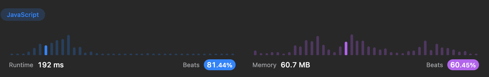

# Daily challenge - March 17th, 2023

## Implement a Trie

<https://leetcode.com/problems/implement-trie-prefix-tree/description/>

nice video description here: <https://www.youtube.com/watch?v=TaROsKvSGjs&t=95s>

```js
/**
* Your Trie object will be instantiated and called as such:
* var obj = new Trie()
* obj.insert(word)
* var param_2 = obj.search(word)
* var param_3 = obj.startsWith(prefix)
*/
```


```js
class TrieNode {
  constructor() {
    this.children = {};
    this.isEndOfWord = false;
  }
}

class Trie {
  constructor() {
    this.root = new TrieNode();
  }
  /** Descend the tree for each character in the new word, creating a node if the
   *  character doesn't exist. Then, mark the end node as such.
   * @param {string} word
   * @return {void}
   */
  insert(word) {
    let currentNode = this.root;
    for (let i = 0; i < word.length; i++) {
      const char = word[i];
      if (!currentNode.children[char]) {
        currentNode.children[char] = new TrieNode();
      }
      currentNode = currentNode.children[char];
    }
    currentNode.isEndOfWord = true;
  }
  /**
   * @param {string} word
   * @return {boolean}
   */
  search(word) {
    let currentNode = this.root;
    for (let i = 0; i < word.length; i++) {
      const char = word[i];
      if (!currentNode.children[char]) {
        return false;
      }
      currentNode = currentNode.children[char];
    }
    return currentNode.isEndOfWord;
  }
  /**
   * @param {string} prefix
   * @return {boolean}
   */
  startsWith(prefix) {
    let currentNode = this.root;
    for (let i = 0; i < prefix.length; i++) {
      const char = prefix[i];
      if (!currentNode.children[char]) {
        return false;
      }
      currentNode = currentNode.children[char];
    }
    return true;
  }
}
```

### Optimized Version

<https://leetcode.com/problems/implement-trie-prefix-tree/submissions/916907418/>


```js
class TrieNode {
  constructor() {
    this.children = new Map();
    this.isEndOfWord = false;
  }
}

class Trie {
  constructor() {
    this.root = new TrieNode();
  }
  /** 
   * @param {string} word
   * @return {void}
   */
  insert(word) {
    let currentNode = this.root;
    for (const char of word) {
      currentNode = currentNode.children.get(char) || currentNode.children.set(char, new TrieNode()).get(char);
    }
    currentNode.isEndOfWord = true;
  }
  /**
   * @param {string} word
   * @return {boolean}
   */
  search(word) {
    let currentNode = this.root;
    for (const char of word) {
      currentNode = currentNode.children.get(char);
      if (!currentNode) {
        return false;
      }
    }
    return currentNode.isEndOfWord;
  }
  /**
   * @param {string} prefix
   * @return {boolean}
   */
  startsWith(prefix) {
    let currentNode = this.root;
    for (const char of prefix) {
      currentNode = currentNode.children.get(char);
      if (!currentNode) {
        return false;
      }
    }
    return true;
  }
}

```

### Here is the non-constructor class version



```js
var TrieNode = function () {
  this.children = {};
  this.isEndOfWord = false;
};

var Trie = function () {
  this.root = new TrieNode();
};

/** 
* @param {string} word
* @return {void}
*/
Trie.prototype.insert = function (word) {
  let currentNode = this.root;
  for (let i = 0; i < word.length; i++) {
    const char = word[i];
    if (!currentNode.children[char]) {
      currentNode.children[char] = new TrieNode();
    }
    currentNode = currentNode.children[char];
  }
  currentNode.isEndOfWord = true;
};

/**
* @param {string} word
* @return {boolean}
*/
Trie.prototype.search = function (word) {
  let currentNode = this.root;
  for (let i = 0; i < word.length; i++) {
    const char = word[i];
    if (!currentNode.children[char]) {
      return false;
    }
    currentNode = currentNode.children[char];
  }
  return currentNode.isEndOfWord;
};

/**
* @param {string} prefix
* @return {boolean}
*/
Trie.prototype.startsWith = function (prefix) {
  let currentNode = this.root;
  for (let i = 0; i < prefix.length; i++) {
    const char = prefix[i];
    if (!currentNode.children[char]) {
      return false;
    }
    currentNode = currentNode.children[char];
  }
  return true;
};
```
